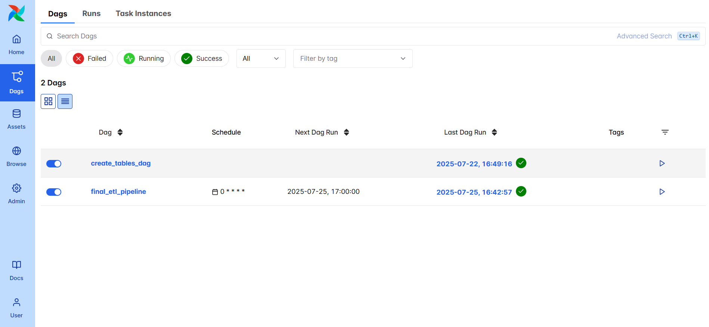
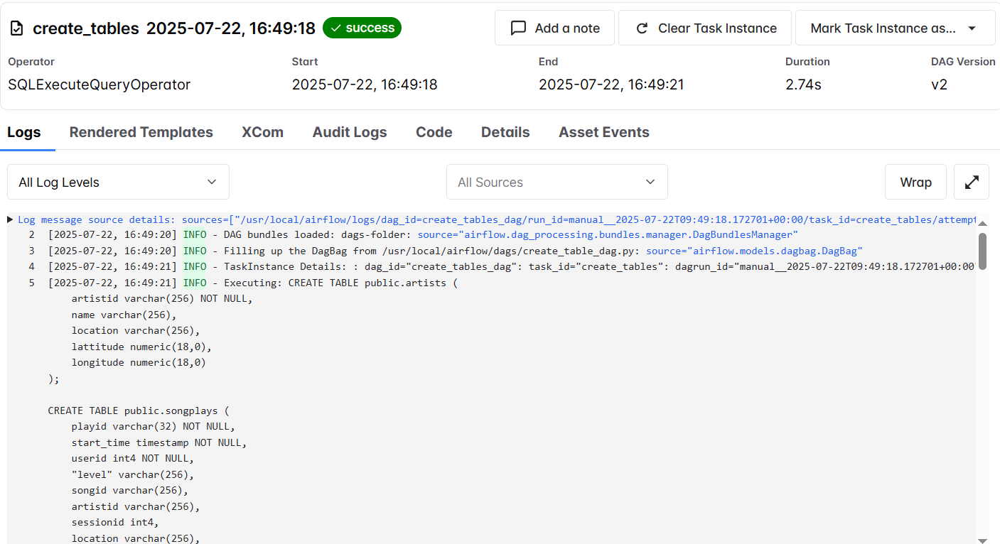
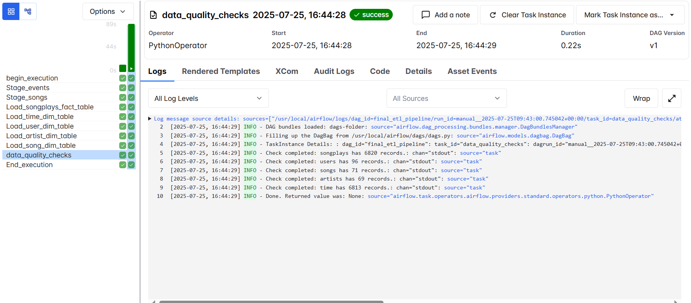

** Cài đặt docker, astro cli

** Mở terminal trong folder, chạy: astro dev start

** Mở connections và config như sau:
    - conn_id: postgres
    - conn_type: postgres
    - conn_host: postgres
    - conn_schema: postgres
    - conn_login: postgres 
    - conn_password: postgres
    - conn_port: 5432

** Chạy dag create_tables_dag_

** Chạy final_etl_pipeline

